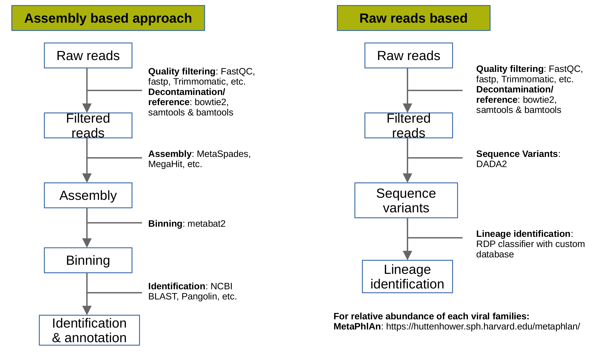

# Viral metagenomics approaches


# Installing requirements
1. [FastQC](https://www.bioinformatics.babraham.ac.uk/projects/fastqc/) For quality analysis of raw reads
```
sudo apt install fastqc
```
2. [fastp](https://github.com/OpenGene/fastp) For filtering and trimming reads based on quality
```
wget http://opengene.org/fastp/fastp
chmod a+x ./fastp
```
3. [bowtie2](http://bowtie-bio.sourceforge.net/bowtie2/index.shtml) For read mapping

```
sudo apt install bowtie2
```
4. [samtools](http://www.htslib.org/) For conversion of sam to bam file format
```
sudo apt install samtools
```
5. [bedtools](https://bedtools.readthedocs.io/en/latest/) For extracting reads which are mapped or not mapped on reference
```
sudo apt install bedtools
```
6. [spades](https://github.com/ablab/spades) For assembling reads
```
sudo apt install spades
```

# Download data for tutorial
Download simulated tutorial data. The data is simulated using [InSilicoSeq](https://insilicoseq.readthedocs.io/en/latest/iss/generate.html) and includes reads from Influenza virus, coronavirus 2 isolate (B.1.1.519) and some human genome reads.

# 1. Assembly based approach
The goal of this approach is to generate genome assemblies of all present viruses in the metagenomic samples. Briefly, steps involved in this approach are filtering, decontamination or reference based selection of reads, genome assembly, identification and genome annotation.

1. **QC and Filtering**:
    The raw metagenomic reads are filtered and trimmed on the basis of quality scores assigned to each bases by the sequencers.  
    
    * Run fastQC for quality check
        ```
        # run on both forward and reverse reads
        fastqc tutorial_R1.fastq.gz
        fastqc tutorial_R2.fastq.gz
        ```
    * Observe the quality reports generated by fastQC and select the filtering and trimming cut-offs accordingly. Run *fastp* to filter reads
        ```
        fastp -i tutorial_R1.fastq.gz -I tutorial_R2.fastq.gz -o tutorial_filtered_R1.fastq.gz -O tutorial_filtered_R2.fastq.gz -z 9 -q 15 -n 10 -e 20 -l 250
        ```
        -i: read1 input file name

        -I: read2 input file name

        -o: read1 output file name

        -O: read2 output file name

        -z: compression level for output

        -q: the quality value that a base is qualified

        -n: if one read's number of N base is >n_base_limit, then this read/pair is discarded

        -e: if one read's average quality score <avg_qual, then this read/pair is discarded.

        -l: reads shorter than length_required will be discarded


2. **Decontamination/reference selection**:
The metagenomes from any environment can contain the contamination for example, DNA/RNA fragments from other microbial organisms or host fragments. To remove these reads decontamination process is required. Our simulated data contains viral reads from Influenza virus, coronavirus 2 isolate (B.1.1.519) and some human genome reads. This analysis is focussed on viral genome only, hence, we will download genomes of Orthomyxoviridae and Coronaviridae families. If the analysis is not focussed on any one or multiple virus families, then, the whole virus genome database can be downloaded and used [https://www.ncbi.nlm.nih.gov/genomes/GenomesGroup.cgi?taxid=10239&sort=taxonomy](https://www.ncbi.nlm.nih.gov/genomes/GenomesGroup.cgi?taxid=10239&sort=taxonomy)
    
    * Concatenate the genomes in a single multi-fasta file
        ```
        cat Orthomyxoviridae_genomes.fasta Coronaviridae_genomes.fasta > reference_genomes.fasta
        ```
    * Make bowtie2 index of these reference genomes
        ```
        bowtie2-build reference_genomes.fasta reference
        ```
    * Map filtered reads on these reference genomes
        ```
        bowtie2-align-s -1 tutorial_filtered_R1.fastq.gz -2 tutorial_filtered_R2.fastq.gz -x reference -p 8 -S reference_mapped.sam
        ```
    * Convert sam to bam file format
        ```
        samtools view -S -b reference_mapped.sam >reference_mapped.bam
        ```
    * Extract mapped reads (reference) from bam file
        ```
        bamToFastq -i reference_mapped.bam -fq reference_mapped_R1.fastq -fq2 reference_mapped_R2.fastq
        ```
3. **Genome assembly**: The extracted reads belong to the reference genomes we used in step above (viral genomes). We will no assemble all reads to generate scaffolds.
    ```
    spades.py -1 reference_mapped_R1.fastq -2 reference_mapped_R2.fastq -o genome_assembly --meta -t 8
    ```
4. **Binning**: This step is required when metagenome is complex (include multiple viral genomes or organisms). If the genome quality is good then this step can be skipped.

5. **Identification & annotation**:
For identification of viral genomes, 

    ```
    # make blastdb 
    makeblastdb -in reference_genomes.fasta -dbtype nucl -title refgenomes -out blastdb_ref

    # run blast
    blastn -query genome_assembly/scaffolds.fasta -db blastdb_ref -out blast_out.txt -outfmt "6 qseqid sseqid stitle pident length mismatch gapopen qstart qend sstart send evalue bitscore" -max_target_seqs 1
    ```
    **Read more about blast** [output format 6](https://www.metagenomics.wiki/tools/blast/blastn-output-format-6)

## 2. Raw-reads based
The aim of this approach is to calculate the abundance of each virus in the metagenomic sample. There are multiple tools available to do so. One popular tool is [MetaPhlAn](https://huttenhower.sph.harvard.edu/metaphlan/). The filtering and decontamination step remains the same followed by the tutorial given at MetaPhlAn [webpage](https://github.com/biobakery/biobakery/wiki/metaphlan3).

Another approach discussed in [Molina-Mora, Jose Arturo, et al. "Metagenomic pipeline for identifying co-infections among distinct SARS-CoV-2 variants of concern: Study cases from Alpha to Omicron." Scientific Reports 12.1 (2022): 1-10.](https://www.nature.com/articles/s41598-022-13113-4), aims to indetify co-infection of SARS-CoV-2 variants.
